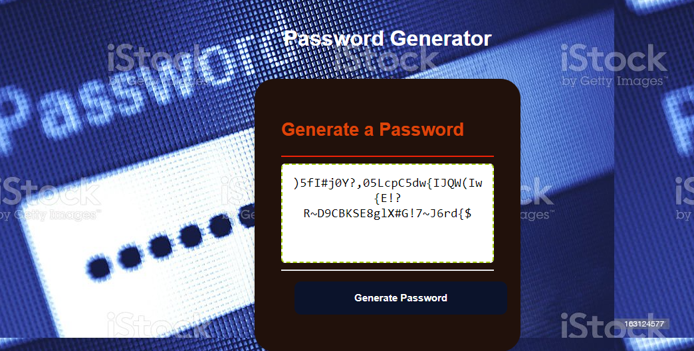

Password Generator

My site: https://movank1.github.io/Challenge-3-Password-w3/

https://github.com/Movank1/Challenge-3-Password-w3/settings/pages




## Acceptance Criteria

```
I need to generate a new, secure password
I first click the button of generate a password
THEN I am presented with a series of choise for password criteria
THEN I make choise of the criteria to include in the secure password
The Secuere password length should be at least 8 characters and less than 128 characters
WHEN asked for character types to include in the password
Crick ok to include lowercase, uppercase, numeric,  special characters
WHEN I answer each prompt
THEN my input should be validated and at least one character type should be selected
WHEN all prompts are answered
THEN a password is generated that matches the selected criteria
or arlet message is produced that the password is not meet the criteria
